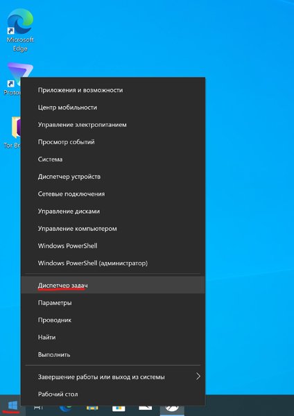
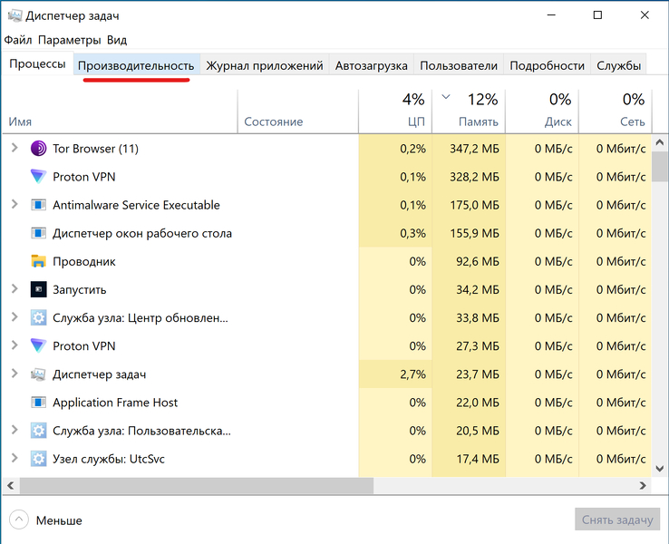
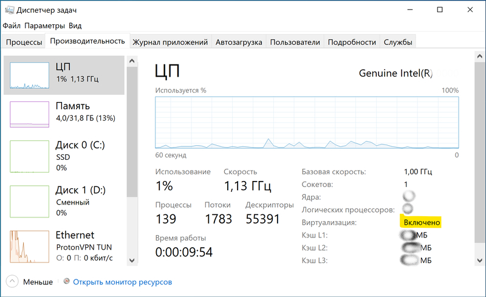

# Проверка доступности системы виртуализации в Windows

#### 1. Правой клавишей мыши нажмите на кнопку "Пуск" и выберите `Диспетчер задач`

#### 2. Переключитесь в подробный режим, нажав `Подробнее`

#### 3. Перейдите на вкладку `Производительность`

#### 4. Характеристика `Виртуализация` должна быть `Включено`

Если виртуализация выключена, то возможны две причины:
1. (наиболее вероятно) Поддержка виртуализации выключена в BIOS. Решение: уточните в инструкции на материнскую плату/ноутбук, как включить `VT-x` в BIOS.

2. Виртуализация не поддерживается процессором.