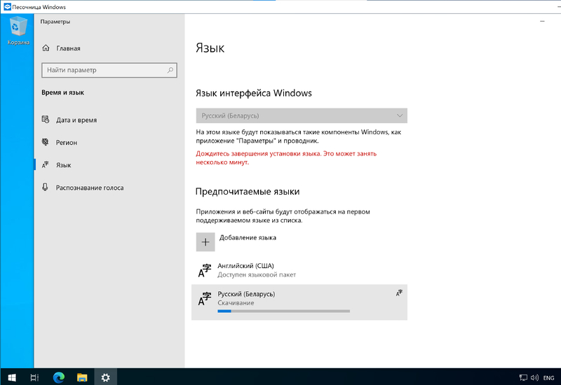

# Добавление раскладки клавиатуры в Windows Sandbox

#### 1. Нажмите кнопку "Пуск" и начните вводить `language` чтобы найти и запустить "Настройка параметров языка и клавиатуры" (достаточно набрать несколько первых букв):

#### 2. Нажмите кнопку `+` `Добавление языка`

#### 3. Начните вводить `belarus` или `russian`, выберите необходимый язык и нажмите `Далее`

#### 4. Если нужна только раскладка клавиатуры, то снимите галочку с `Установить языковый пакет` и нажмите `Установить`. Теперь можно переключать раскладки на клавиатуре.

#### 4А. Можно дополнительно установить языковый пакет:

#### 5. Произойдет скачивание языкового пакета. Теперь можно переключать раскладку клавиатуры

