# Windows Sandbox - Песочница Windows

В Windows версий 10 и 11 присутствет встроенная виртуальная машина, не оставляющая следов - Windows Sandbox (в русском варианте - Песочница Windows).

### Преимущества:

- **Незаметная**. Встроена в операционную систему. Нет необходимости что-то скачивать, устанавливать и хранить. Нужна только настройка. Для работы использует файлы из состава основной Windows.
- **Быстрая**. В Песочнице программы работают почти также быстро, как и основной Windows.
- **Безопасная**. Все данные хранятся в оперативной памяти и полностью исчезают без следа, достаточно нажать кнопку закрытия или отключить питание компьютеру. 

### Системные требования:

- Windows 10/11 (кроме редакции Home/Домашняя)
- В процессоре есть и включены возможности виртуализации
- В процессе настройки компьютер будет один раз перезагружен - позабодьтесь о сохранении рабочих файлов.
<!-- TODO Add "How to enable Virtualization in BIOS" -->

## Установка и запуск

1. Нажмите кнопку "Пуск" и начните вводить `включение` чтобы найти и запустить "Включение или отключение компонентов Windows" (достаточно набрать несколько первых букв):
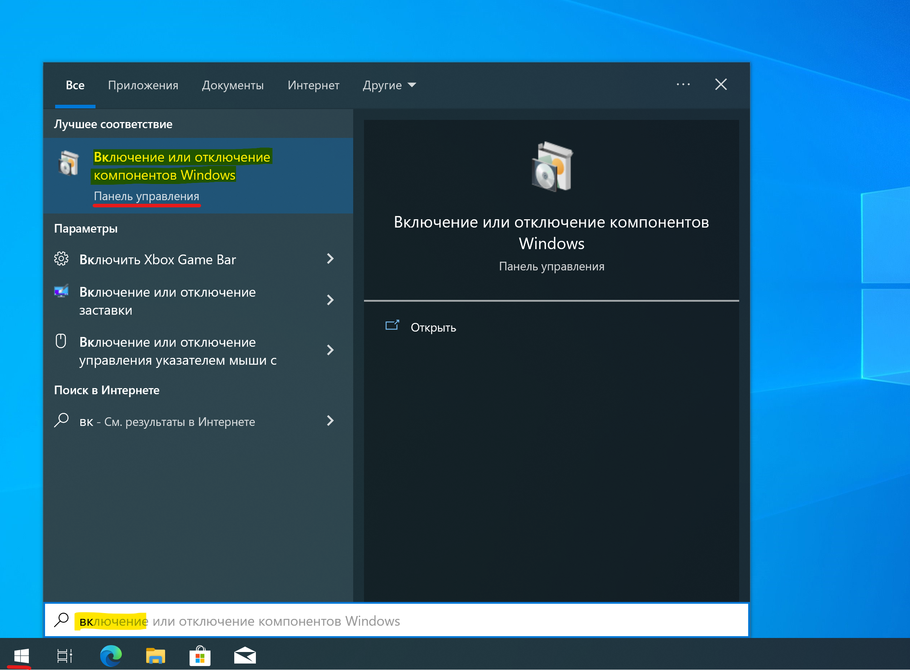
2. В появившемся списке "Компоненты Windows" найдите и отметьте галочкой пункт `Песочница Windows` и нажмите `ОК`:
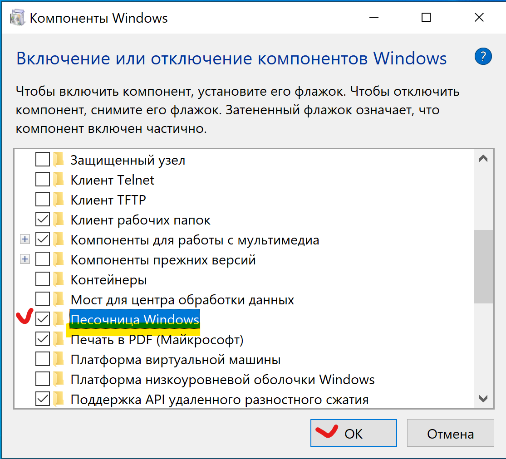
3. Начнется и скоро закончится процесс добавления Песочницы в состав Windows:
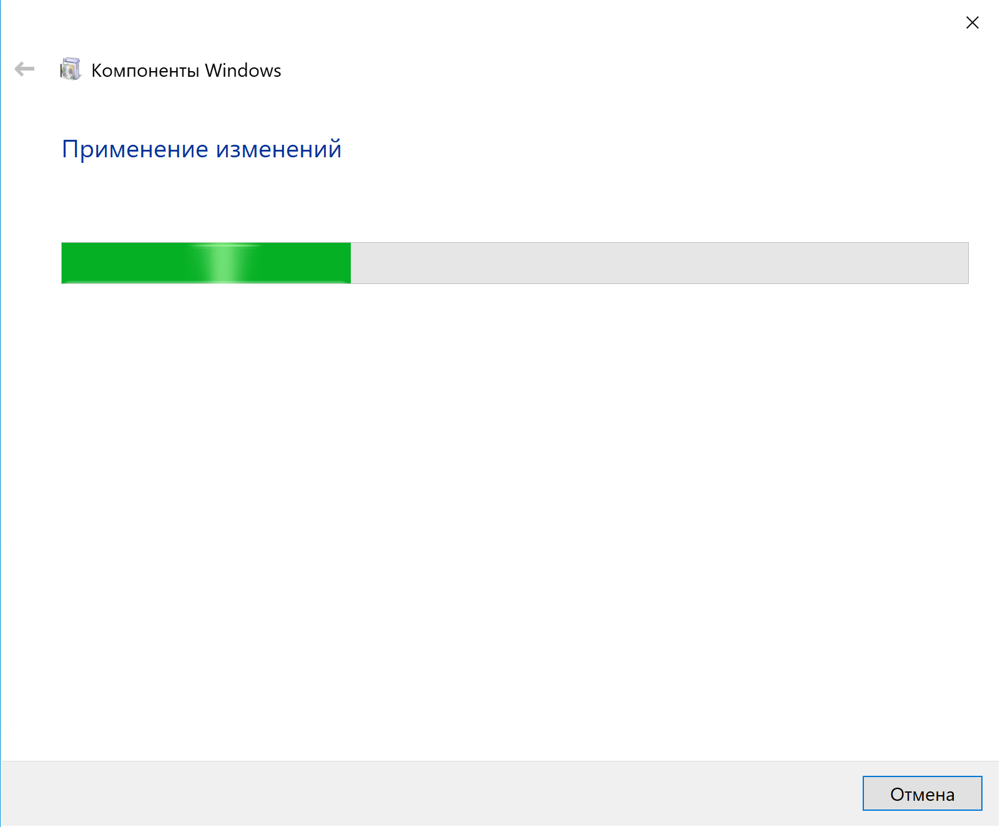 
4. Нажмите `Перезагрузить сейчас`
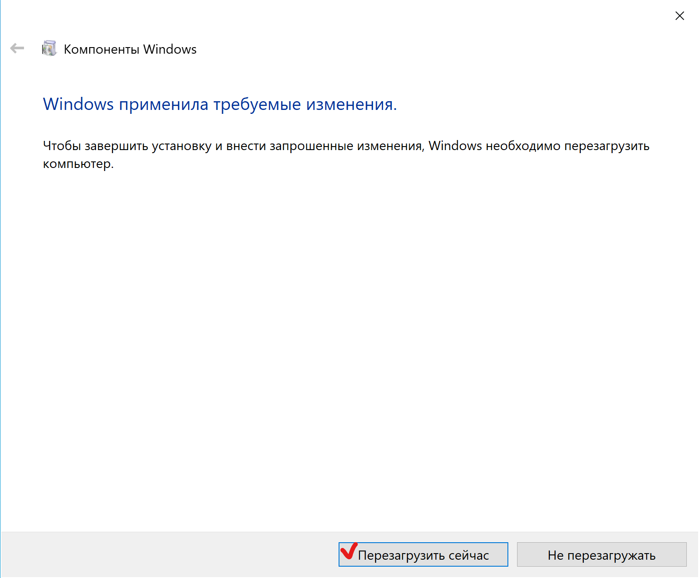
5. После перезагрузки Песочница готова к использованию. Нажмите кнопку "Пуск" и начните вводить `sandbox` чтобы найти и запустить приложение **Windows Sandbox**
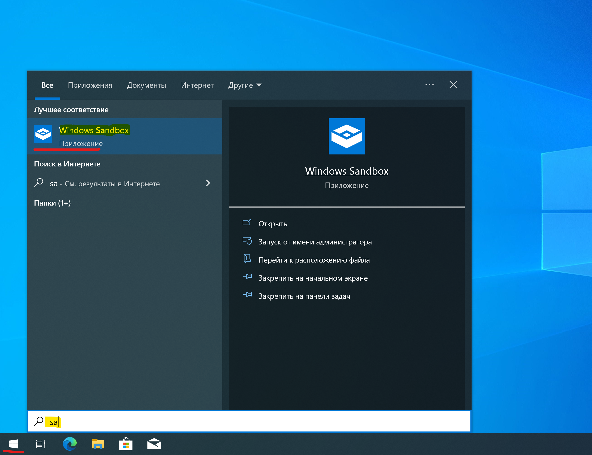
6. Появится окно с логотипом Песочницы. Первый запуск может длится немного дольше обычного:
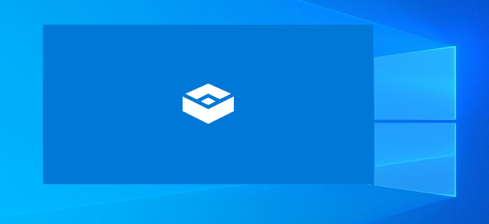
7. Загруженная Песочница готова к "_работе без следов_":
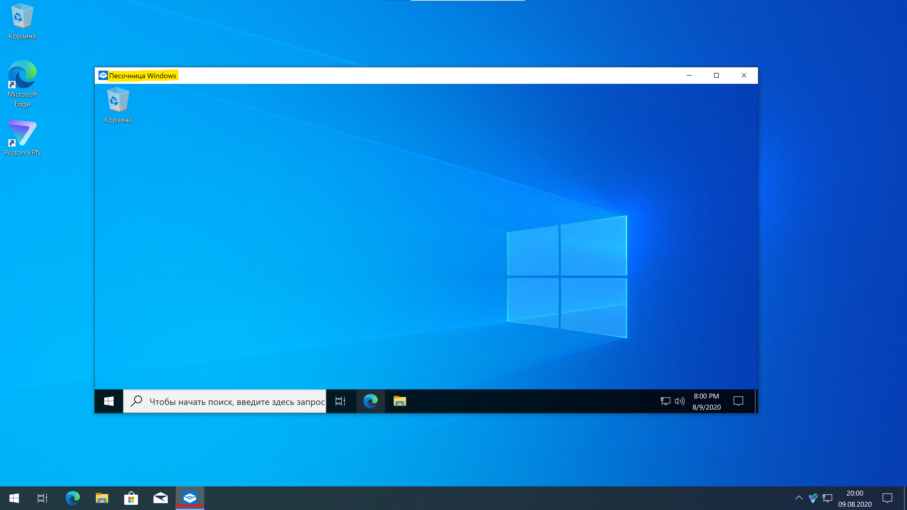
Все данные, файлы, программы и настройки существуют внутри этой полноценной Windows ровно до тех пор, пока вы не нажали кнопку закрытия окна Песочницы. Также все исчезает в случае отключения питания компьютера.

## Работа в Песочнице

1. Если на основной Windows установлен _полноценный_ <!-- TODO Link to explanation" --> VPN, то и Песочница имеет доступ в Интернет тоже только через VPN, без дополнительных настроек:
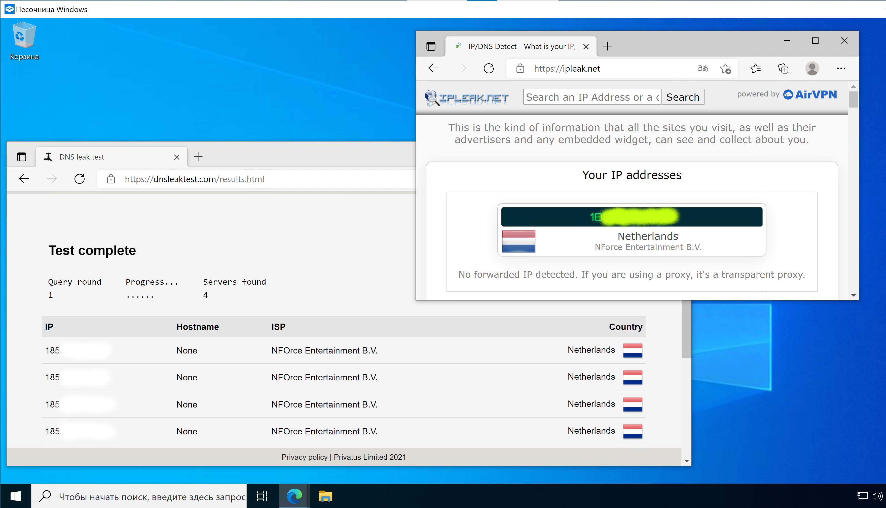
*  Обязательно проверяйте, чтобы VPN пропускал через себя и трафик из Песочницы, для этого откройте https://dnsleaktest.com из Песочницы - в тесте не должно быть флагов авторитарных государств или их союзников.
2. Песочница Windows будет сразу иметь полный набор программ, входящих в комплект поставки основной редакции Windows, в том числе браузер, почтовый клиент, фото редактор и т.п. Другие программы необходимо скачать из Интернета и установить внутри Песочницы. Также рекомендуется поступать со всеми рабочими данными и файлами -  держать их в облачных хранилищах, а после работы закачивать обратно, не допуская размещения на основной системе даже закриптованных копий. 
3. Некоторые очень большие дистрибутивы программ можно хранить на основной системе и копировать в Песочницу через буфер обмена:
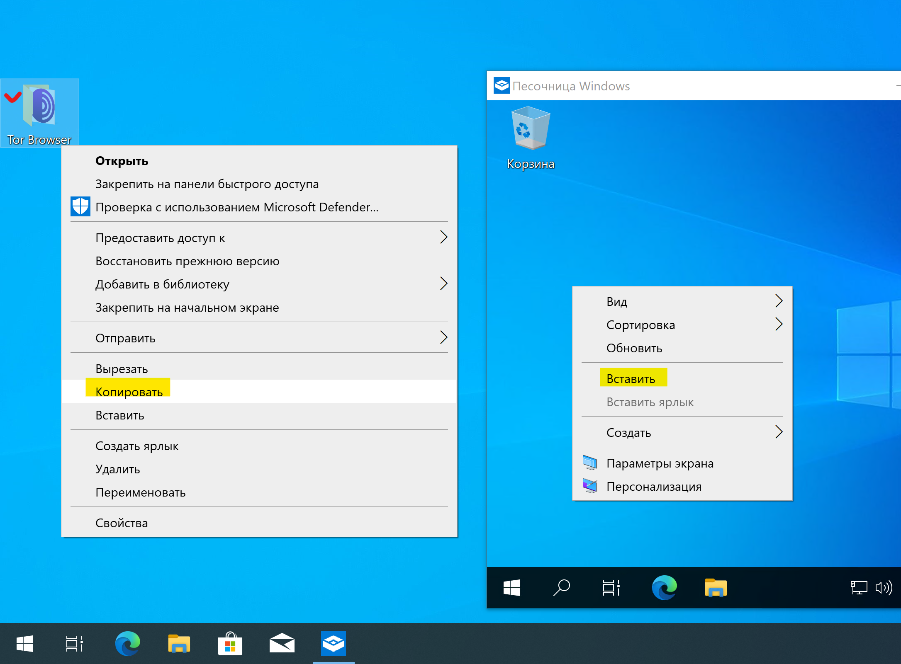
Копирование происходит достаточно быстро, но поступать так следует только в отношении программ, наличие которых не является поводом для дальнейшего расследования или репрессий (офисные пакеты, графические или видео редакторы, средства для разработки неспециализированного ПО):
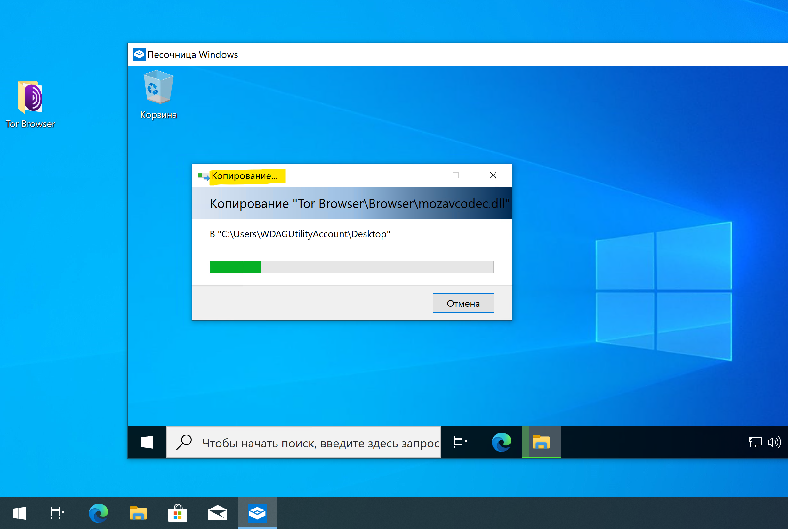

## Завершение работы и удаление

1. По окончанию работы или в случае угрозы безопасности, перемещаем в облачное хранилище рабочие файлы и закрываем окно Песочницы. Подтвердите свое решение кнопкой `OK`, еще раз перевроверив, все ли надежно сохранено. После подтверждения все следы активной деятельности исчезнут безвозвратно: 
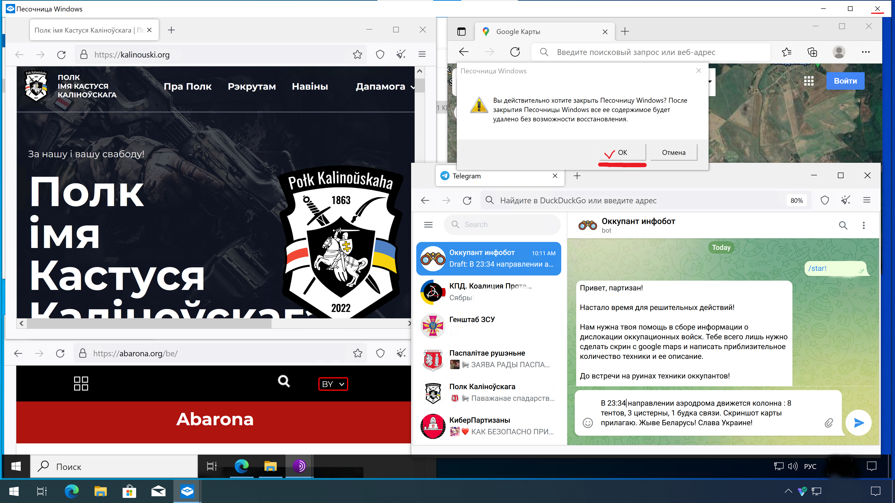
2. Рекомендуется также удалить саму Песочницу с компьютера, так как её наличие может послужить поводом для неудобных вопросов. Процесс аналогичен установке: "Пуск" -> "Включение или отключение компонентов Windows" -> снять галочку с `Песочница Windows` и нажать `ОК`:   
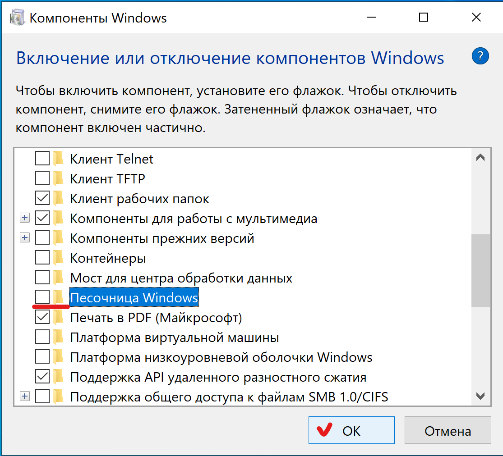
3. Произойдет удаление Песочницы, компьютер будет перезагружен и вы сможете вернуться к "мирной" жизни без опаски за свою безопасность на случай конфискации и изучения техники криминалистами:
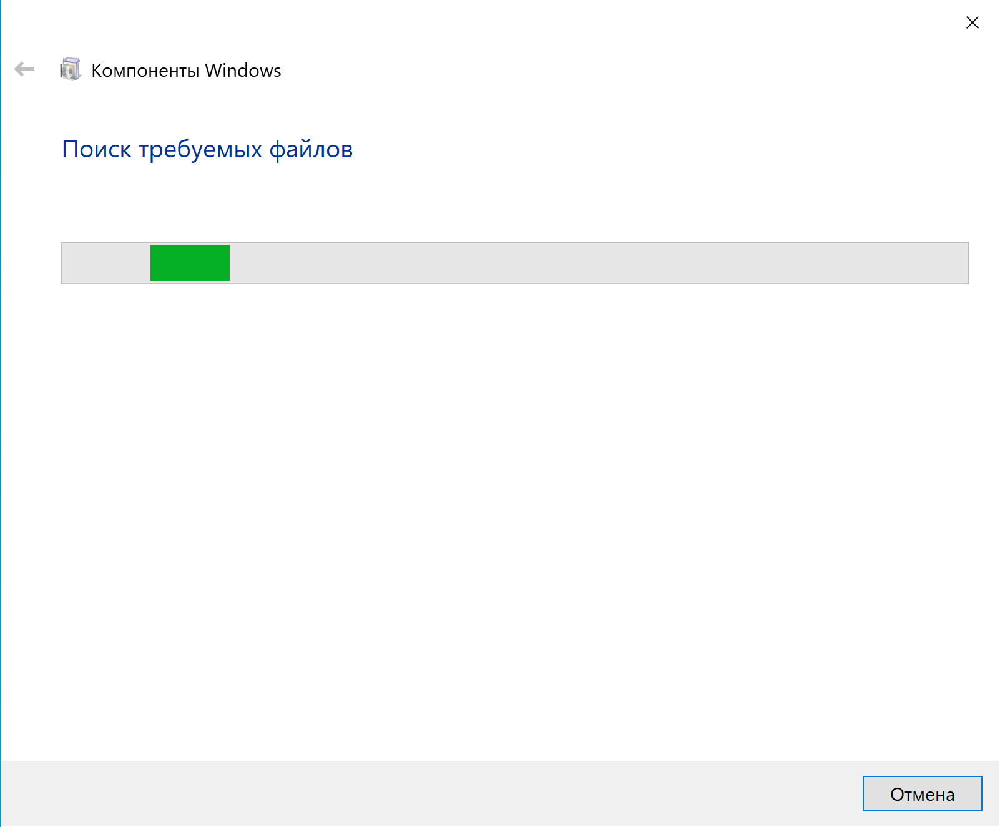
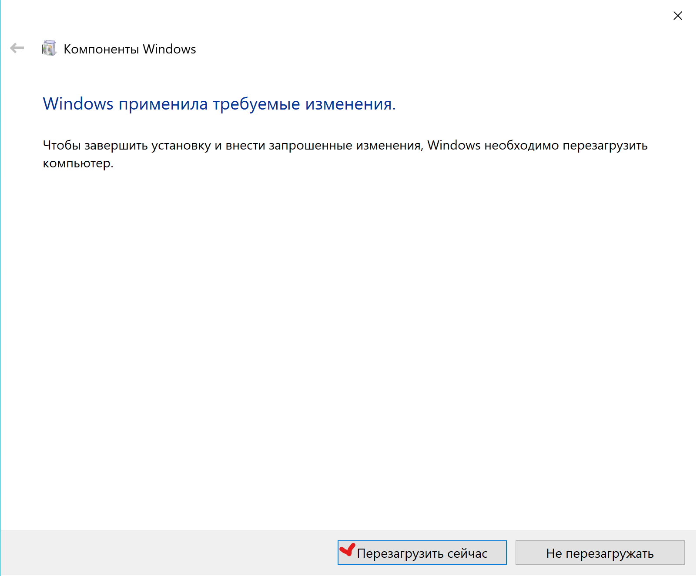

## Дополнительные удобства

### Добавление второй раскладки клавиатуры

В зависимости от языка и конфигурации основной Windows в Песочнице может не оказаться беларуской/русской раскладок клавиатуры. Их необходимо [добавить вручную]().

### Добавление второй раскладки клавиатуры

По умолчанию, в целях безопасности и анонимности, Песочница не использует графический ускоритель компьютера. Для большинства офисных приложений и сайтов это практически не заметно, но если приходится использовать более требовательные программы - необходимо [изменить конфигурацию вручную](CONFIG.md).

